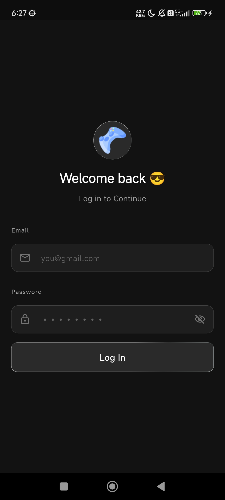
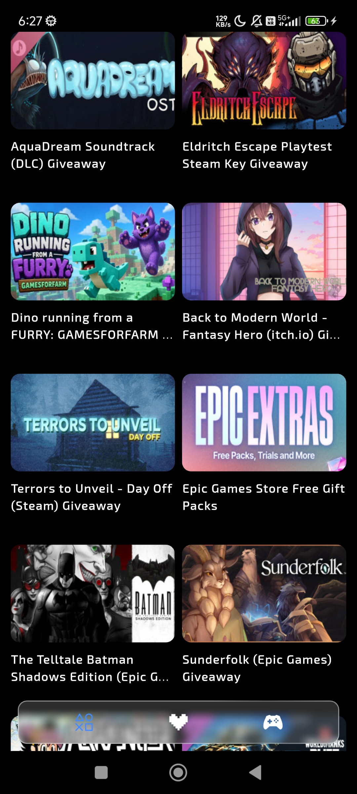

# 🎮 ClaimIt

### Your daily free game drops — all in one place


**Never miss a free game again.**
ClaimIt aggregates free game giveaways from Epic Games, Steam, itch.io and more — all in one clean mobile app.

[⬇️ Download APK](#download) · [🐛 Report Bug](https://github.com/srinibuson/GameClaimApp/issues) · [✨ Request Feature](https://github.com/srinibuson/GameClaimApp/issues)

</div>

---

## 📱 Screenshots

> Splash · Login · Home Feed

| Splash                       | Login                      | Home                     |
| ---------------------------- | -------------------------- | ------------------------ |
|  |  |  |

---

## ✨ Features

- 🎮 **Live Giveaways** — Browse active free game giveaways updated daily
- 🔑 **Claim Direct** — One tap to claim via official store page (Epic, Steam, itch.io)
- ❤️ **Save Favourites** — Like and save giveaways to your personal list
- 🔐 **Firebase Auth** — Secure email & password login
- ☁️ **Cloud Sync** — Saved items synced via Firestore across sessions
- ⏳ **Countdown Timers** — See exactly how long each giveaway lasts

---

## 🚧 In Progress

- [ ] FreeToGame API integration (Browse F2P games)
- [ ] IsThereAnyDeal API (Discounted deals tab)
- [ ] Push notifications for new drops
- [ ] Platform filter chips (Epic / Steam / itch.io)
- [ ] Ending soon urgency strip
- [ ] Google Sign-In

---

## 🛠️ Built With

| Technology      | Purpose              |
| --------------- | -------------------- |
| Flutter         | Cross-platform UI    |
| Firebase Auth   | User authentication  |
| Cloud Firestore | Saved items storage  |
| GamerPower API  | Live giveaway data   |
| GetX            | Navigation & routing |
| url_launcher    | Deep link to stores  |

---

## 🚀 Getting Started

### Prerequisites

- Flutter SDK `>=3.0.0`
- Android device or emulator
- Firebase project (see setup below)

### Installation

**1. Clone the repo**

```bash
git clone https://github.com/srinibuson/GameClaimApp.git
cd GameClaimApp
```

**2. Install dependencies**

```bash
flutter pub get
```

**3. Firebase Setup**

- Create a Firebase project at [console.firebase.google.com](https://console.firebase.google.com)
- Enable **Authentication** (Email/Password)
- Enable **Firestore Database**
- Download `google-services.json` and place it in `android/app/`

**4. Run the app**

```bash
flutter run
```

---

## ⬇️ Download

> No Play Store yet — download the APK directly from GitHub Releases

[](https://github.com/srinibuson/GameClaimApp/releases)

---

## 📡 API Used

**GamerPower API** — Free, no key required

```
https://www.gamerpower.com/api/giveaways
```

Returns active giveaways with title, thumbnail, worth, end date, platform, and claim URL.

---

## 🗂️ Project Structure

```
lib/
├── Controller/          # Business logic (ChangeNotifier)
│   ├── loginController.dart
│   └── dashboardCtrl.dart
├── Screens/             # UI screens
│   ├── splash_screen.dart
│   ├── login_screen.dart
│   └── dashboard/
├── Services/            # Firebase & API services
│   └── firestore_service.dart
├── Models/              # Data models
│   └── giveaway.dart
├── Constant/            # Routes, theme, helpers
└── main.dart
```

---

## 🤝 Contributing

This is a personal portfolio project — contributions aren't open yet.
Feel free to fork and build your own version!

---

## 👨‍💻 Developer

**Srinivas**
Flutter Developer · Building ClaimIt as a portfolio project

[](https://github.com/srinibuson)

---

<div align="center">
  <sub>Built with ❤️ using Flutter · Data powered by GamerPower API</sub>
</div>
